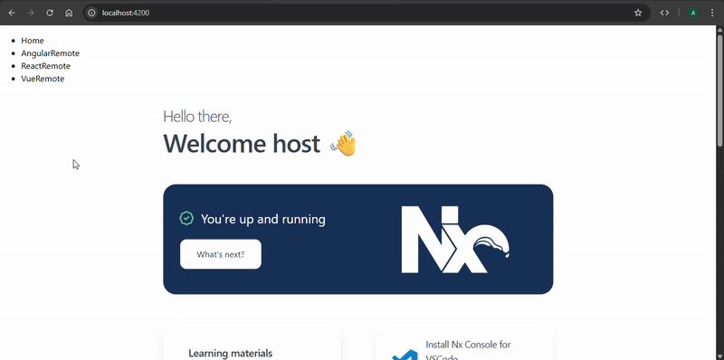

# Building a Micro-Frontend Monorepo with Cross-Framework Using Nx and Module Federation

## Table of Contents
1. [Overview](#overview)
2. [Prerequisites](#prerequisites)
3. [Step 1: Initialize Nx Workspace](#step-1-initialize-nx-workspace)
4. [Step 2: Install Required Dependencies](#step-2-install-required-dependencies)
5. [Step 3: Generate the Host Application (Angular)](#step-3-generate-the-host-application-angular)
6. [Step 4: Generate Micro-Frontend Applications](#step-4-generate-micro-frontend-applications)
7. [Step 5: Configure Module Federation](#step-5-configure-module-federation)
8. [Step 6: Run the Application](#step-6-run-the-application)
9. [Output](#output)
10. [Conclusion](#conclusion)

## Overview

This guide walks you through creating a monorepo with an Angular host application that consumes remote micro-frontends built with Angular, React, and Vue frameworks within a single Nx workspace. Module Federation enables runtime loading of independently deployable micro-frontend applications, making it perfect for micro-frontend architectures where each remote app operates autonomously.

## Prerequisites

- Node.js 18+ installed
- npm package manager
- Basic knowledge of Angular, React, and Vue
- Understanding of TypeScript
- Familiarity with Webpack and Module Federation

## Step 1: Initialize Nx Workspace

First, create a new Nx workspace:

```bash
npx create-nx-workspace@latest nx-mfe-tutorial --preset=apps
# Skip the prompts related to CI provider and remote caching.
```

```bash
cd nx-mfe-tutorial
```

## Step 2: Install Required Dependencies

Install the necessary Nx plugins for all three frameworks and Module Federation:

```bash
# Install framework plugins
npx nx add @nx/angular
npx nx add @nx/react
npx nx add @nx/vue

# Install additional dependencies
npm i @originjs/vite-plugin-federation --save-dev
npm i @angular-architects/module-federation --save-dev
npm i @angular-architects/module-federation-tools --save-dev
npm i @angular-architects/module-federation-runtime --save-dev --legacy-peer-deps
```

## Step 3: Generate the Host Application (Angular)

Create an Angular application that will serve as the main host for consuming our remote micro-frontends:

```bash
npx nx generate @nx/angular:host --directory=apps/host --e2eTestRunner=none --standalone=false --style=scss --unitTestRunner=none --no-interactive
```

## Step 4: Generate Micro-Frontend Applications

### Angular Remote Application

```bash
npx nx generate @nx/angular:remote --directory=apps/angularRemote --host=host --e2eTestRunner=none --standalone=false --style=scss --unitTestRunner=none --no-interactive
```

### React Remote Application

```bash
npx nx generate @nx/react:remote --directory=apps/reactRemote --bundler=webpack --e2eTestRunner=none --style=scss --unitTestRunner=none --no-interactive
```

### Vue Remote Application

```bash
npx nx generate @nx/vue:application --directory=apps/vueRemote --bundler=vite --e2eTestRunner=none --style=scss --unitTestRunner=none --no-interactive
```

> Since Webpack is not supported for Vue in Nx, Vite is used as the bundler along with the `@originjs/vite-plugin-federation` plugin to enable Module Federation.

## Step 5: Configure Module Federation

### Configure Angular Remote

Update `apps/angularRemote/module-federation.config.ts`:

```ts
import { ModuleFederationConfig } from '@nx/module-federation';

const config: ModuleFederationConfig = {
  name: 'angularRemote',
  exposes: {
    './Module': 'apps/angularRemote/src/app/remote-entry/entry-module.ts',
  },
};

/**
 * Nx requires a default export of the config to allow correct resolution of the module federation graph.
 **/
export default config;
```
> Nx usually handles this automatically. If not, apply the configuration manually.

### Configure React Remote

> Since React is a different framework from Angular, direct integration is not possible. Instead, React components should be exposed as Web Components (Custom Elements) to be loaded within the Angular host.

Create `apps/reactRemote/src/web-components.tsx`:

```tsx
import React from 'react';
import ReactDOM from 'react-dom/client';
import App from './app/app';

class ReactRemote extends HTMLElement {
    connectedCallback() {
        const mountPoint = document.createElement('div');
        this.appendChild(mountPoint);
        ReactDOM.createRoot(mountPoint).render(
            <React.StrictMode>
                <App />
            </React.StrictMode>
        );
    }
}

if (!customElements.get('react-remote')) {
    customElements.define('react-remote', ReactRemote);
}
```

Update `apps/reactRemote/module-federation.config.ts`:

```ts
import { ModuleFederationConfig } from '@nx/module-federation';

const config: ModuleFederationConfig = {
  name: 'reactRemote',
  exposes: {
    './Module': './src/remote-entry.ts',
    './WebComponents': './src/web-components.tsx',
  },
};

/**
 * Nx requires a default export of the config to allow correct resolution of the module federation graph.
 **/
export default config;
```

### Configure Vue Remote

> Similar to React, Vue components cannot be directly integrated into Angular. These must be exposed as Web Components (Custom Elements).

Create `apps/vueRemote/src/web-components.ts`:

```ts
import { defineCustomElement } from "vue";
import App from "./app/App.vue";

const VueRemote = defineCustomElement(App, { shadowRoot: false });

if (!customElements.get('vue-remote')) {
    customElements.define('vue-remote', VueRemote);
}
```

Update `apps/vueRemote/vite.config.ts`:

```ts
/// <reference types='vitest' />
import { defineConfig } from 'vite';
import vue from '@vitejs/plugin-vue';
import { nxViteTsPaths } from '@nx/vite/plugins/nx-tsconfig-paths.plugin';
import { nxCopyAssetsPlugin } from '@nx/vite/plugins/nx-copy-assets.plugin';
import federation from '@originjs/vite-plugin-federation';

export default defineConfig(() => ({
  root: __dirname,
  cacheDir: '../../node_modules/.vite/apps/vueRemote',
  server: {
    port: 4300,
    host: 'localhost',
  },
  preview: {
    port: 4301,
    host: 'localhost',
  },
  plugins: [
    vue(),
    nxViteTsPaths(),
    nxCopyAssetsPlugin(['*.md']),
    federation({
      name: 'vueRemote',
      filename: 'remoteEntry.js',
      exposes: {
        './WebComponents': './src/web-components.ts'
      }
    }),
  ],
  // Uncomment this if you are using workers.
  // worker: {
  //  plugins: [ nxViteTsPaths() ],
  // },
  build: {
    outDir: '../../dist/apps/vueRemote',
    emptyOutDir: true,
    reportCompressedSize: true,
    commonjsOptions: {
      transformMixedEsModules: true,
    },
  },
}));
```

### Configure Host Application (Angular)

Update `apps/host/module-federation.config.ts`:

```ts
import { ModuleFederationConfig } from '@nx/module-federation';

const config: ModuleFederationConfig = {
  name: 'host',
  /**
   * To use a remote that does not exist in your current Nx Workspace
   * You can use the tuple-syntax to define your remote
   *
   * remotes: [['my-external-remote', 'https://nx-angular-remote.netlify.app']]
   *
   * You _may_ need to add a `remotes.d.ts` file to your `src/` folder declaring the external remote for tsc, with the
   * following content:
   *
   * declare module 'my-external-remote';
   *
   */
  remotes: ['angularRemote', 'reactRemote'],
};

/**
 * Nx requires a default export of the config to allow correct resolution of the module federation graph.
 **/
export default config;
```

Update `apps/host/src/app/app.routes.ts`:

```ts
import { NxWelcome } from './nx-welcome';
import { Route } from '@angular/router';
import { WebComponentWrapper, WebComponentWrapperOptions } from '@angular-architects/module-federation-tools';

export const appRoutes: Route[] = [
  {
    path: 'angularRemote',
    loadChildren: () =>
      import('angularRemote/Module').then((m) => m!.RemoteEntryModule),
  },
  {
    path: 'reactRemote',
    component: WebComponentWrapper,
    data: {
      remoteEntry: 'http://localhost:4202/remoteEntry.js',
      remoteName: 'reactRemote',
      exposedModule: './WebComponents',
      elementName: 'react-remote'
    } as WebComponentWrapperOptions
  },
  {
    path: 'vueRemote',
    component: WebComponentWrapper,
    data: {
      type: 'module',
      remoteEntry: 'http://localhost:4301/assets/remoteEntry.js',
      remoteName: 'vueRemote',
      exposedModule: './WebComponents',
      elementName: 'vue-remote'
    } as WebComponentWrapperOptions
  },
  {
    path: '',
    component: NxWelcome,
  },
];
```

> Notice the use of `WebComponentWrapper` and `WebComponentWrapperOptions` from the `@angular-architects/module-federation-tools` package. These utilities are designed to simplify the integration of Web Components (Custom Elements) - such as those built with React or Vue or even Angular into Angular applications. By leveraging this wrapper, remote components exposed as custom elements can be seamlessly rendered within Angular routes without additional boilerplate code.

> The `@angular-architects/module-federation` library enables Webpack Module Federation in Angular projects by providing schematics and builders to expose or consume remote modules with minimal configuration. Its companion package, `@angular-architects/module-federation-tools`, extends this functionality with runtime helpers such as `WebComponentWrapper` making it especially useful for cross-framework micro-frontend scenarios where different technologies need to interoperate smoothly inside an Angular shell.

> Learn more about **Angular Architects** here: [Angular Architects](https://www.angulararchitects.io/en/blog/the-microfrontend-revolution-module-federation-in-webpack-5/)

Update `apps/host/src/app/app.html`:

```html
<ul class="remote-menu">
  <li><a routerLink="/">Home</a></li>
  <li><a routerLink="angularRemote">AngularRemote</a></li>
  <li><a routerLink="reactRemote">ReactRemote</a></li>
  <li><a routerLink="vueRemote">VueRemote</a></li>
</ul>
<router-outlet></router-outlet>
```

## Step 6: Run the Application

Start the Vue remote first since it uses Vite:

```bash
npx nx run vueRemote:preview
```

Then run the host application:

```bash
npx nx run host:serve
```

> Running the host will automatically build and serve Angular and React remotes using Webpack Module Federation.

## Output


## Conclusion

This guide has walked you through setting up a powerful micro-frontend architecture using Nx and Module Federation, bringing together **Angular**, **React**, and **Vue** applications into a single cohesive system. By leveraging "**Webpack Module Federation** for Angular and React, and **Vite Plugin Federation** for Vue, we achieved runtime integration of independently deployable micro-frontends within an Angular host application.

Key libraries used include:
- **@angular-architects/module-federation** and **module-federation-tools** for seamless federation and dynamic loading in Angular.
- **@originjs/vite-plugin-federation** to enable Module Federation with Vite-powered Vue apps.
- **WebComponentWrapper** utility for rendering cross-framework components as Web Components inside Angular routes.

To **share common components, styles, or utilities**, you can:
- Create **shared libraries** using Nx generators (e.g., `npx nx g @nx/angular:library shared-ui`) to contain reusable code.
- Use **Nx's built-in dependency graph** to manage and visualize library usage across applications.
- Integrate **Storybook** for isolated component development and documentation.
- Share global styles, fonts, and assets via a global styles library or common assets folder referenced in each framework’s configuration.

For **testing**, you can:
- Use **Jest** (Angular/React) or **Vitest** (Vue) for unit testing.
- Integrate **Cypress** or **Playwright** for end-to-end testing, either per app or from the host level.
- Use **Nx Cloud** for distributed computation caching and analytics to speed up CI pipelines.

For **deployment**, each remote application can be deployed **independently** to separate domains or CDNs, while the host dynamically loads them at runtime. This ensures true decoupling and scalability. Nx also supports modern CI/CD integrations, allowing for optimized incremental builds and automatic deployment via GitHub Actions, GitLab, Azure DevOps, and more.

With this setup, your organization can embrace a **polyglot micro-frontend architecture** that empowers teams to build, test, and deploy features independently using the frameworks of their choice—all while maintaining a unified user experience.

---

> _Final version of this application can be found [here &raquo;]()_